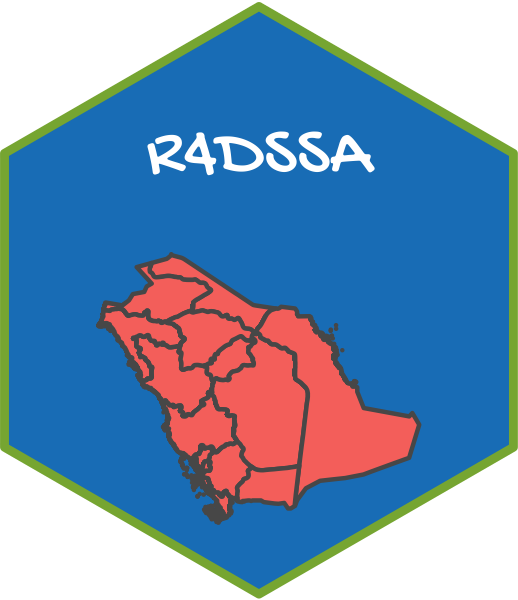

<!-- README.md is generated from README.Rmd. Please edit that file -->

     
     

## Tidy_Friday

سوف نقوم في كل يوم جمعة بإضافة جدول بيانات جديد، سوف نحاول ان تكون
البيانات عن المملكة العربية السعودية بقدر الإمكان.

ليس هناك اي متطلبات لطريقة تحليل البيانات ، حيث يمكنك بناء نموذج او
إنشاء رسم بياني او كتابة تقرير اوعمل ماتريد.

اذا كنا لديك اي سؤال او تحتاج الى مساعدة فنحن نرحب بك في مجتمعنا `R4DS
Online Learning Community Saudi` على
[`slack`](https://join.slack.com/t/r4dssa/shared_invite/zt-fyg8b592-7L7PFhbOt8AM0oWDWZjYfg)

## R4DS Online Learning Community Saudi

ملهمين بمجتمع `R4DS Online Learning Community` قمنا بإنشاء `R4DS Online
Learning Community Saudi`

حيث نهدف الى نتبادل الخبرات والاستشارات عن تحليل البيانات بإستخدام `R`
غالبا سوف نستخدم المكتبات التي قام بتطويرها فريق
[`Rstudio`](https://rstudio.com/) وهي
[`Tidyverse`](https://www.tidyverse.org/)
[`Tidumodels`](https://www.tidymodels.org/)
[`Shiny`](https://shiny.rstudio.com/) وغيرها من المكتبات التي تتبع
`Tidyverse Ecosystem`

<!-- badges: start -->

<!-- badges: end -->

## مصادر نرشحها لتعلم R

احد أهم المصادر هو [Rstudio Education](https://education.rstudio.com)

كما يمكنك البحث عن الكتب المجانية المتعلقة ب R
[هنا](https://bookdown.org/home/tags/)

[هنا تجد تلخيص وترجمة للباب الثاني من كتاب R4ds باللغة العربية](https://rpubs.com/Naif_8/628469)

هنا تجد مجموعة من الكتب مفتوحة المصدر بالإضافة الى بعض التسجيلات علي
يوتيوب

### مدخل الى تعلم R

1- [R4ds](https://r4ds.had.co.nz) (يعد هذا الكتاب اهم مصدر لتعلم R)

2- [R Cookbook](https://rc2e.com)

3- [Hadly\`s Recordings on
YouTube](https://www.youtube.com/watch?v=go5Au01Jrvs)

### تصوير البيانات

1- [ggplot2: Elegant Graphics for Data
Analysis](https://ggplot2-book.org)

2- [The R Graph Gallery](https://www.r-graph-gallery.com)

3- [Fundamentals of Data
Visualization](https://serialmentor.com/dataviz/)

4- [Thomas Recordings on
YouTube](https://www.youtube.com/watch?v=h29g21z0a68&t=7028s)

5- [Data Visualization with R](https://rkabacoff.github.io/datavis/)

### إحصاء

1- [Statistical Inference via Data Science](https://moderndive.com)

### Rmarkdown

1- [R Markdown: The Definitive
Guide](https://bookdown.org/yihui/rmarkdown/)

2- [Rmarkdown Cookbook](https://bookdown.org/yihui/rmarkdown-cookbook/)

### بناء النماذج

1- [Feature Engineering and Selection: A Practical Approach for
Predictive Models](http://www.feat.engineering)

2- [The Elements of Statistical Learning: Data Mining, Inference, and
Prediction](https://web.stanford.edu/~hastie/ElemStatLearn/)

3- [An Introduction to Statistical Learning: with Applications in
R](https://faculty.marshall.usc.edu/gareth-james/ISL/ISLR%20Seventh%20Printing.pdf)

4- [tidymodels](https://www.tidymodels.org/learn/)

### تحليل النصوص

1- [Text Mining](https://www.tidymodels.org/books/tidytext/)

### مصادر اخرى

1- [Rweekly](https://rweekly.org)

2- [David Robinson\`s YouTube
channel](https://www.youtube.com/user/safe4democracy)

3- [Julia Silge\`s YouTube
channe](https://www.youtube.com/channel/UCTTBgWyJl2HrrhQOOc710kA)

4- [دروس
مجانية](https://education.rstudio.com/blog/2020/05/remote-roundup/)

